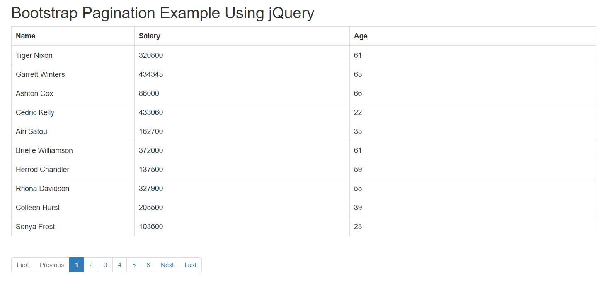

## simple-example-pagination-using-jquery-bootstrap in docker

## 專案資料夾與檔案格式說明  

| 型態 | 名稱 | 說明 | 路徑 |
| --- | --- | --- | --- |
| 資料夾 | app | 專案主要程式碼 | 根目錄 |
| 檔案 | Dockerfile.local | (可調整)本地端部屬使用 | 根目錄 |
| 檔案 | docker-compose.yaml | (可調整)本地端快速部屬使用 | 根目錄 |
| 資料夾 | iiidevops | :warning: devops系統測試所需檔案 | 在根目錄 |
| 檔案 | .rancher-pipeline.yml | :warning: (不可更動)devops系統測試所需檔案 | 在根目錄 |
| 檔案 | pipeline_settings.json | :warning: (不可更動)devops系統測試所需檔案 | 在iiidevops資料夾內 |
| 檔案 | postman_collection.json | (可調整)devops newman部屬測試檔案 | iiidevops/postman資料夾內 |
| 檔案 | postman_environment.json | (可調整)devops newman部屬測試檔案 | iiidevops/postman資料夾內 |
| 檔案 | Dockerfile | (可調整)devops k8s環境部屬檔案 | 根目錄 |

## iiidevops
* 專案內`.rancher-pipeline.yml`原則上請不要自行更動，除非您已完全了解 pipeline 的語法以及 III DevOps 對 Pipeline 的修改原則
* `iiidevops`資料夾內`pipeline_settings.json`為該範本的定義檔, 保留原本內容才有機會之後進行範本升級
* `postman`資料夾內則是您在devops管理網頁上的Postman-collection(newman)自動測試檔案，devops系統會以`postman`資料夾內檔案做自動測試
* `Dockerfile`內image前加上dockerhub，是為使image能透過本地端harbor當Proxy至Docker Hub下載image，解決多主機多專案環境重複至 Docker Hub下載相同image問題

## preview

## Reference
[simple-example-pagination-using-jquery-bootstrap](https://www.js-tutorials.com/jquery-tutorials/simple-example-pagination-using-jquery-bootstrap/)
[jquery-ajax-url-local-or-absolute](https://stackoverflow.com/questions/24164327/jquery-ajax-url-local-or-absolute)
